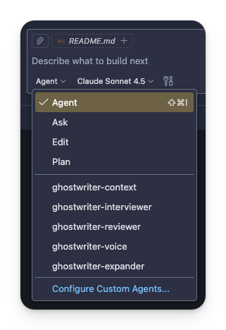
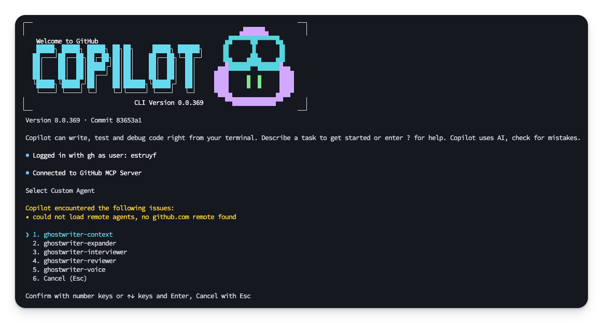
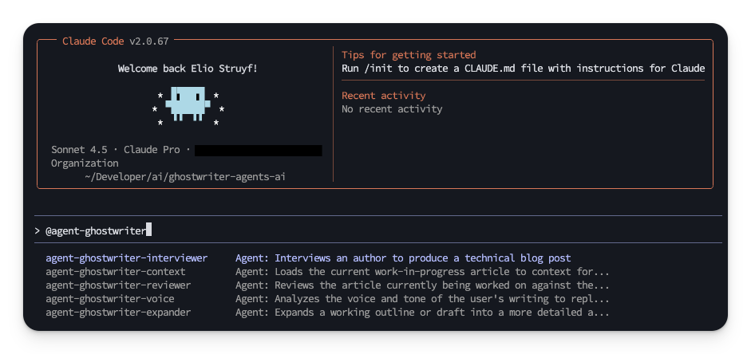
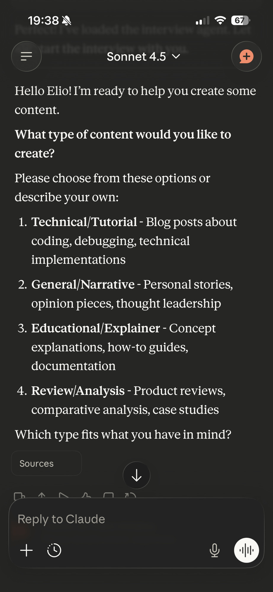

# Ghostwriter Agents

> AI-powered writing agents for VS Code, GitHub Copilot, and Claude

Install a collection of specialized AI agents designed to help you write content
following the "cozy web" editorial philosophy.

> The project is inspired by
> [Speedgrapher](https://github.com/danicat/speedgrapher), an MCP server
> designed to assist professional writers.

## Features

The **Ghostwriter Agents** consists of five specialized agents that work
together to help you:

- **Interviewer:** Conduct structured interviews to gather raw material for
  articles.
- **Writer:** Expand outlines and drafts into comprehensive articles.
- **Reviewer:** Provide actionable feedback based on editorial guidelines.
- **Context Loader:** Load your current draft into context for seamless editing.
- **Voice Analyzer:** Analyze your writing style to maintain a consistent voice.

## Quick Start

```bash
# Install agents for all platforms (VS Code, Copilot, Claude)
npx @estruyf/ghostwriter

# Install for specific platforms
npx @estruyf/ghostwriter --vscode
npx @estruyf/ghostwriter --copilot
npx @estruyf/ghostwriter --claude
```

After installation:
1. Restart your editor
2. Start using agents depends on the AI tool you use (see Platform-Specific
   Setup)
   - [VS Code](#vs-code)
   - [GitHub Copilot CLI](#github-copilot-cli)
   - [Claude](#claude)
   - [Web and Mobile AI Clients](#web-and-mobile-ai-clients)

## Agents

### 🔄 Context Loader (`@ghostwriter-context`)
Loads your current work-in-progress article into context for further commands.

**Use when:** Starting a new editing session or switching between drafts.

### 🎤 Interviewer (`@ghostwriter-interviewer`)
Conducts structured interviews to gather material for blog posts, articles,
reviews, and more. Asks one question at a time, collects code snippets, error
logs, and real-world examples.

**Use when:** Starting a new article from scratch or gathering material from
recent work.

**Workflow:**
1. Start: `@ghostwriter-interviewer`
2. Answer questions naturally, sharing code/logs when asked
3. Say "stop" when finished
4. Request transcript: "Can you provide the interview transcript?"
5. Save as `INTERVIEW.md`

### ✍️ Writer (`@ghostwriter-writer`)
Expands working outlines or drafts into comprehensive, detailed articles while
maintaining your voice and narrative flow.

**Use when:** You have an outline or thin draft that needs expansion.

**Features:**
- Adds context without fluff
- Links to official documentation (with `TODO` placeholders for uncertain URLs)
- Explains *why* code does what it does
- Maintains narrative thread

### 🔍 Reviewer (`@ghostwriter-reviewer`)
Reviews articles against editorial guidelines, providing concrete, actionable
feedback.

**Use when:** You have a complete draft ready for review.

**Checks for:**
- Narrative thread and structure
- Technical accuracy
- Tone (honest about pain and payoff)
- Code quality and citations
- Missing resources section

### 🎨 Voice Analyzer (`@ghostwriter-voice`)
Analyzes your existing writing to create a reusable style guide that other
agents can follow.

**Use when:** Setting up agents for the first time or refining your voice
profile.

**Outputs:**
- Voice profile (tone, pacing, formality)
- Style rules (do/don't bullets)
- Lexicon (favorite phrases, words to avoid)
- Structure patterns

## Editorial Philosophy

Ghostwriter agents follow the **"cozy web"** editorial approach:

### Core Principles

1. **Honest (Pain and Payoff)**
   - Don't sanitize the process
   - Share cryptic error messages and failed attempts
   - Show the real debugging journey

2. **Professional Peer**
   - Assume smart readers who lack specific context
   - Avoid "just" and "simply" (patronizing words)
   - Write as an experienced peer sharing knowledge

3. **Narrative Focus**
   - Every article needs a thread (journey, mystery, exploration)
   - Show struggles and breakthroughs
   - Real-world examples and actual output

4. **Technical Excellence**
   - Copy-paste runnable code
   - Link to official documentation
   - Realistic variable names
   - Explain *why*, not just *what*

## Typical Workflow

### From Interview to Published Article

```bash
# 1. Conduct interview
@ghostwriter-interviewer
# ... answer questions, share code/logs
# Save transcript to INTERVIEW.md

# 2. Create initial outline from interview
@ghostwriter-writer Please create an outline from INTERVIEW.md

# 3. Expand sections
@ghostwriter-writer Expand the "Debugging the Issue" section

# 4. Review draft
@ghostwriter-context  # Load current draft
@ghostwriter-reviewer

# 5. Polish based on feedback
@ghostwriter-writer Address reviewer feedback: add more context to the error handling section

# 6. Final voice check (optional)
@ghostwriter-voice Analyze my previous articles in ./content/posts
```

### From Existing Outline

```bash
# 1. Load outline
@ghostwriter-ghostwriter-context

# 2. Expand
@ghostwriter-writer Expand this outline into a full article

# 3. Review and iterate
@ghostwriter-reviewer
@ghostwriter-writer Fix the issues noted by the reviewer
```

## Platform-Specific Setup

### VS Code

Agents are installed to `.github/agents/` in your project.

Access via the agent selector in the chat view of GitHub Copilot.

<div align="center">
  
  <p><em>VS Code Agents</em></p>
</div>

### GitHub Copilot CLI

Agents are installed to `~/.copilot/agents/`.

Access them by invoking Copilot CLI in your terminal, and using the `/agent`
command to select the desired agent you want to interact with.

<div align="center">
  
  <p><em>Copilot Agents</em></p>
</div>

### Claude

Agents are installed to `~/.claude/agents/`.

In the Claude CLI, use the following commands to interact with agents:

- `@agent-ghostwriter-interviewer`
- `@agent-ghostwriter-writer`
- `@agent-ghostwriter-reviewer`
- `@agent-ghostwriter-context`
- `@agent-ghostwriter-voice`

<div align="center">
  
  <p><em>Claude Agents</em></p>
</div>

### Web and Mobile AI Clients

If you want, you can also use the agents on mobile AI clients like GitHub
Copilot, Claude Mobile, or others. To do so, you will need to tell it to fetch
the agent definition from the GitHub repository.

For GitHub Copilot Web, you can use the following link:

<a
href="https://github.com/copilot?prompt=Fetch%3A%20https%3A%2F%2Fraw.githubusercontent.com%2Festruyf%2Fghostwriter-agents-ai%2Frefs%2Fheads%2Fmain%2Fagents%2Finterview.ghostwriter.md%0A%0AUse%20the%20agent%20to%20start%20the%20interview"
target="_blank" class="" aria-label="Run this prompt in Copilot Chat"
aria-describedby="2929304522" style="text-decoration:none;"> Start the interview
in GitHub Copilot Web
</a>

In other clients, use the following prompt to fetch the agent definition:

```plaintext
Fetch: https://raw.githubusercontent.com/estruyf/ghostwriter-agents-ai/refs/heads/main/agents/interview.ghostwriter.md

Use the agent to start the interview
```

<div align="center">
  
  <p><em>Mobile AI Client Agents</em></p>
</div>

## Command Reference

```bash
npx ghostwriter [options]

Options:
  --vscode      Install agents for VS Code only
  --copilot     Install agents for GitHub Copilot only
  --claude      Install agents for Claude only
  --all         Install agents for all platforms (default)
  --uninstall   Uninstall agents from specified platforms
  --help, -h    Show this help message

Examples:
  npx ghostwriter                    # Install for all platforms
  npx ghostwriter --vscode           # Install for VS Code only
  npx ghostwriter --copilot --claude # Install for Copilot and Claude
  npx ghostwriter --uninstall        # Uninstall from all platforms
  npx ghostwriter --uninstall --vscode # Uninstall from VS Code only
```

## Troubleshooting

### Agents not appearing

**Solution:** Restart your editor after installation.

### "Cannot find agent" error

- **VS Code:** Verify files exist in `.github/agents/`
- **Copilot:** Verify files exist in `~/.copilot/agents/`
- **Claude:** Verify files exist in `~/.claude/agents/`

### Agent behavior seems off

**Solution:** Check that you're using the latest version:
```bash
npx @estruyf/ghostwriter@latest
```

### Links are marked as TODO

This is expected! The writer agent only adds links when confident they're
correct. Replace `TODO` placeholders with the actual URLs.

## Contributing

Found a bug or have a suggestion?
[Open an issue](https://github.com/eliostruyf/ghostwriter-agents-ai/issues).

## License

MIT © Elio Struyf

## Learn More

- [GitHub Repository](https://github.com/eliostruyf/ghostwriter-agents-ai)
- [Report Issues](https://github.com/eliostruyf/ghostwriter-agents-ai/issues)

<div align="center">
<a
href="https://visitorbadge.io/status?path=https%3A%2F%2Fgithub.com%2Festruyf%2Fghostwriter-agents-ai"></a>
</div>